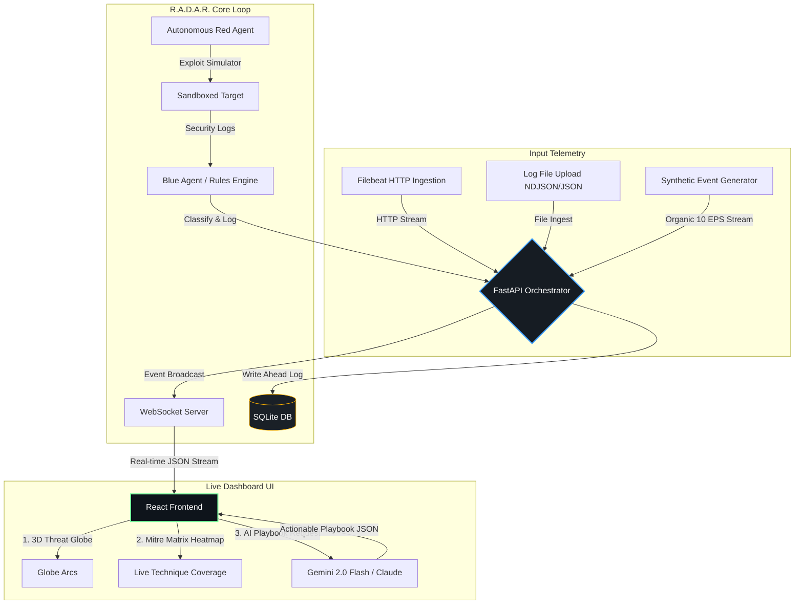

# ⚡ R.A.D.A.R. — Real-time Autonomous Defense And Response

<div align="center">
  
  
  
  
  
  
</div>

<p align="center">
  <b>RADAR</b> is a production-grade Cybersecurity Security Operations Center (SOC) dashboard driven by an autonomous Red/Blue agent loop. It continuously simulates attacks, detects malicious telemetry, correlates multi-vector security logs, and generates one-click AI-powered Incident Response (IR) playbooks.
</p>

---

## 🗺️ System Architecture & Data Flow

Below is the live operational pipeline showing how telemetry converges into the dashboard and feeds the autonomous feedback loop:



---

## 🚀 Key Features

*   **🌐 3D Interactive Threat Globe:** Renders real-time attack arcs from external geolocated source IPs (powered by `ip-api.com` with a 3-layer in-memory and database cache) to a protected-asset marker.
*   **🤖 Autonomous Red/Blue Loop:** Simulated attacks map to standard MITRE ATT&CK techniques, letting defenders monitor the loop stage in real-time (Scan → Attack → Detect → Remediate → Re-test).
*   **⚡ One-Click AI Incident Response Playbooks:** Integrates directly with **Gemini 2.0 Flash** (primary) and **Claude** (fallback) to provide immediate situation summaries, containment steps, and CLI remediation commands.
*   **📊 MITRE ATT&CK Matrix Heatmap:** Live tile states (untested, exploited, mitigated) derived automatically from database event correlation.
*   **📈 Replay Engine (Stress Tester):** Supports stress-testing the UI rendering at configurable speed multipliers up to **500x (~5,000 events/sec)**.
*   **📡 Stream & Upload Ingestion:** Accept Filebeat HTTP output streams and manual NDJSON/JSON logs.
*   **📱 Mobile & Responsive UI:** Fully responsive layout designed with Tailwind CSS, supporting mobile master-detail views, hamburger navigation, and collapsible sidebars.
*   **🛡️ Deploy Shield Toggle:** Direct control to engage/disengage live log monitoring with state-driven topbar indicators.

---

## 🛠️ Tech Stack

*   **Backend:** Python (3.12+), FastAPI, Uvicorn, SQLite (`aiosqlite` with WAL mode for concurrency), `pydantic-settings`.
*   **Frontend:** React 18, Vite, Tailwind CSS, Recharts (Uptime trend lines), Three.js (3D globe projection).
*   **AI Integration:** Google Generative AI SDK (`gemini-2.0-flash-exp`), Anthropic SDK.

---

## 📦 Installation & Setup

Ensure you have **Python 3.12+** and **Node.js 18+** installed.

### 1. Clone & Set Up Backend

```bash
# Navigate to the backend directory
cd radar

# Create a virtual environment
python -m venv .venv
source .venv/bin/activate  # On Windows: .venv\Scripts\activate

# Install dependencies (handles modern Pydantic binary wheels)
pip install -r backend/requirements.txt
```

Create a `.env` file in the `radar/` folder using the template:

```env
GEMINI_API_KEY=your_gemini_api_key_here
BACKEND_PORT=8080
FRONTEND_ORIGIN=http://localhost:5173
LOG_LEVEL=info
```

### 2. Start the Backend

```bash
# From the radar/ directory
.venv\Scripts\uvicorn backend.main:app --host 0.0.0.0 --port 8080 --reload
```

The server will automatically initialize the database (`radar.db`) and seed it with 5,000 baseline historical events.

### 3. Set Up Frontend

```bash
# Navigate to the frontend directory
cd radar/frontend

# Install node packages
npm install
```

### 4. Run Frontend Locally

```bash
npm run dev
```

Open [http://localhost:5173](http://localhost:5173) in your browser.

---

## ⚡ Deployment (Vercel Compatible)

The frontend is fully compatible with Vercel and can be deployed with one click:

1.  Connect this repository to your **Vercel** account.
2.  Set the **Root Directory** as `radar/frontend`.
3.  Configure the build command: `npm run build` and output directory: `dist`.
4.  Configure the following Environment Variables in Vercel:
    *   `VITE_API_URL`: Your deployed FastAPI backend URL (e.g. `https://api.yourradar.com`)
    *   `VITE_WS_URL`: Your deployed WebSocket backend URL (e.g. `wss://api.yourradar.com`)
5.  Deploy! Vercel handles the SPA rewrites automatically using the included `vercel.json`.

---

## 📱 Mobile Compatibility & Responsiveness

The user interface has been optimized for multi-device monitoring:
- **Collapsed Sidebar & Drawer Menu:** Hamburger navigation panel on phone screen heights.
- **Stacked Layout:** Grids collapse from 4 columns to 2 or 1 column dynamically.
- **Incident Master-Detail:** Mobile layout switches between the incident list and details view with an interactive back button.
- **Table Scroll:** Logs and lists scroll horizontally preserving structured telemetry data.

---

## 📄 License

Distributed under the MIT License. See `LICENSE` for more information.

<p align="center">
  <b>SECURE TRANSMISSION END // R.A.D.A.R. SYSTEM CORE</b>
</p>
