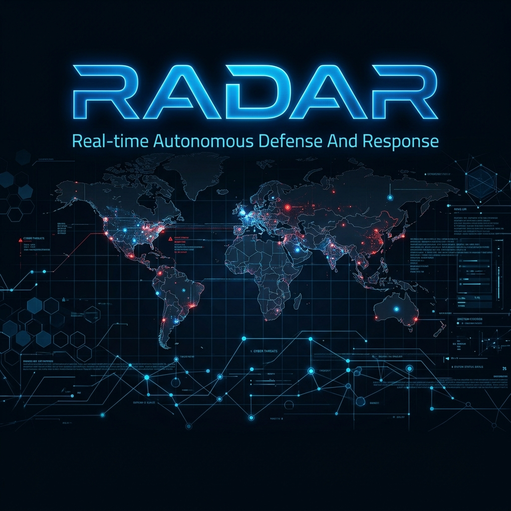

<div align="center">



# RADAR — Real-time Autonomous Defense And Response
### *Enterprise-Grade Real-Time Cyber Threat Intelligence, Live Packet Capture & Autonomous Incident Response Platform*

[](https://python.org)
[](https://fastapi.tiangolo.com)
[](https://react.dev)
[](https://threejs.org)
[](https://tailwindcss.com)
[](https://attack.mitre.org)
[](LICENSE)

</div>

---
RADAR is an autonomous security Operations Center (SOC) platform designed to detect, visualize, and remediate network cyber threats in real time. It establishes a complete red/blue security loop, linking raw network telemetry directly with interactive 3D visualizations and automated incident response tools.

## Features
- **Real-Time Threat Detection**: Continuously monitors and captures network threat vectors like port scans, brute-force logs, and web exploits.
- **3D Attack Globe**: Interactive 3D threat intelligence globe visualizing attacks in real time using Bezier curves and geodesic arcs.
- **AI Incident Playbooks**: Auto-generates MITRE ATT&CK-aligned response playbooks with containment and recovery commands.
- **AI Incident Reports**: Compiles detailed SOC analyst incident reports with precise attack timelines, IoCs, and escalation notes.
- **MITRE ATT&CK Matrix**: Fully synchronized matrix mapping live threat statistics against real-world techniques.
- **Log Archive**: Access historical logs, sort by severity, search by IP, and inspect payloads.
- **Replay Mode**: Simulate high-velocity attacks (up to 500+ EPS) to stress-test your SOC operations.
- **File & Stream Ingestion**: Easily ingest logs via raw JSON/NDJSON file uploads or live HTTP POST streams.

## Requirements
- Docker Desktop (includes Docker Compose) — https://www.docker.com/products/docker-desktop/
- Git

## Quick Start

### Method 1: Single Docker Command (Simplest — No Cloning Required)
Run this single command in your terminal to pull the pre-built image and start the entire app immediately:
```bash
docker run -d -p 8080:8080 -v radar_data:/app/data -e DATABASE_PATH=/app/data/radar.db pavankumar022/radar:latest
```
Open your browser at: **[http://localhost:8080](http://localhost:8080)**

---

### Method 2: Clone and Run via Docker Compose
1. **Clone the repository**:
   ```bash
   git clone https://github.com/pavankumar022/RADAR-Real-time_Autonomous_Defense_And_Response.git
   cd RADAR-Real-time_Autonomous_Defense_And_Response
   ```

2. **Start the containers**:
   ```bash
   cd radar
   docker compose up --build -d
   ```

3. **Access the application**:
   - **Dashboard UI**: [http://localhost](http://localhost)
   - **Backend Ingestion API**: [http://localhost:8080](http://localhost:8080)
   - **FastAPI Documentation**: [http://localhost:8080/api/docs](http://localhost:8080/api/docs)

---

### 4. Simulate an attack:
To test the live visualization, you can run the bundled simulation scripts from your host machine (requires Python 3 installed):
```bash
# Target your local docker instance with a simulated Nmap port scan
python radar/attack_tools/run_nmap_scan.py --target 192.168.137.140 --radar-url http://localhost:8080

# Target your local docker instance with a simulated SSH brute-force attack
python radar/attack_tools/run_ssh_brute.py --target 192.168.137.140 --radar-url http://localhost:8080
```
